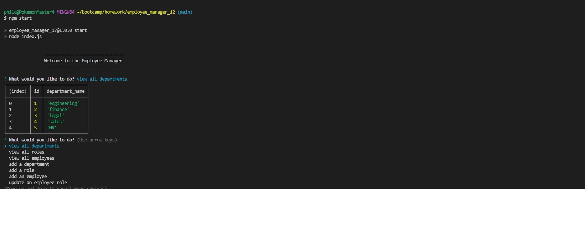

# Employee Manager App
## Description
This project was undertaken as part of a coding bootcamp. In this challenge we were tasked with making a Node JS app that creates a database. You are presented with options that allow you to view all the tables as well as add to them or update them based on user input.

## Installation
If you wish to run this project locally on your own computer, assuming you have git installed, input the following code in your terminal.
git clone https://github.com/YOUR_USERNAME/REPO_NAME.git
## Usage
The live site may be viewed at the following url.
https://github.com/philcurtis4/employee_manager_app_12
Here is a screenshot of the page.

and a walk through video:
https://drive.google.com/file/d/154OZ3tT_VzmGYzzg23ETbq_u1iEOcr1r/view

    
## Credits
The challenge and model of how it should work was given by Rutgers bootcamp. App created by Philip Curtis.
## License
This project has a MIT License. For more information read the LICENSE file.
---
